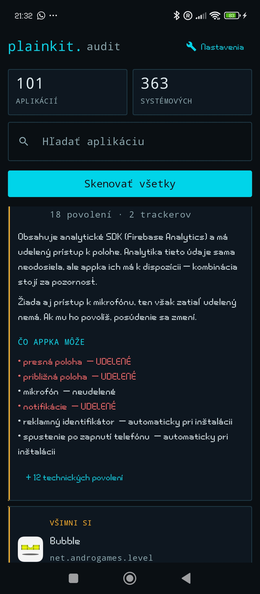
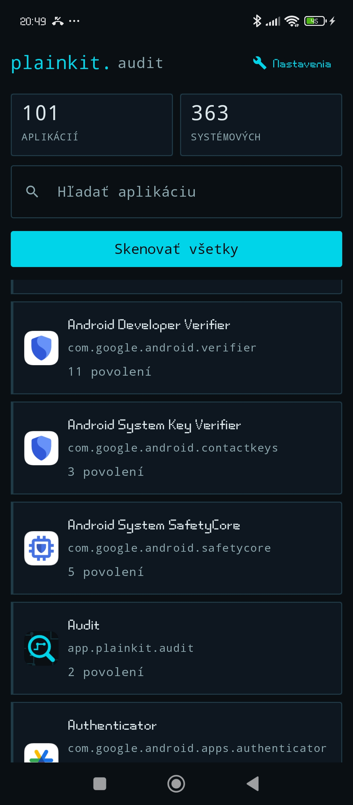
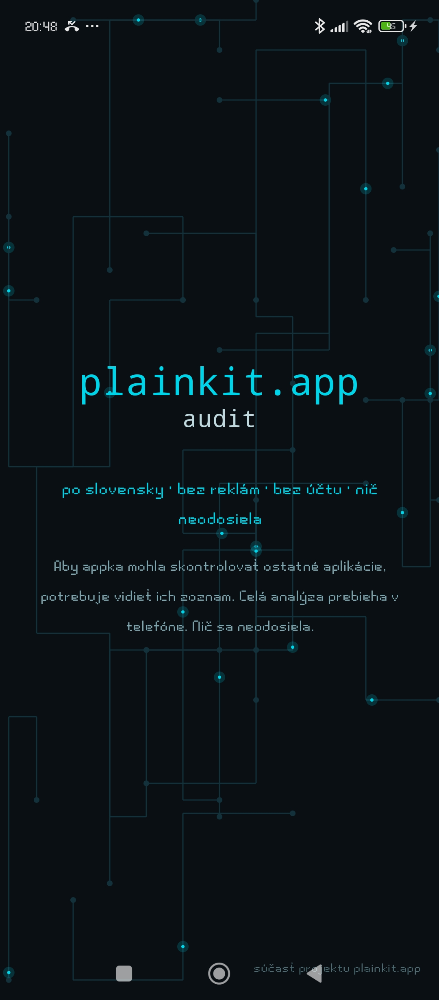

# plainkit. audit

**See what your Android apps can actually do — in plain language.**

Most people never find out that a flashlight app has been granted the
microphone, or that a game they installed last year still has access to their
contacts. Audit lists every installed app and tells you, in a normal sentence,
what it can reach and what it carries inside.

It also looks inside each app's APK for known tracking libraries — advertising,
marketing, analytics, fraud detection, crash reporting — and combines that with
the permissions to say something useful, instead of showing a scary number.

Everything runs on your phone. Nothing is uploaded. No ads, no account.

  
  
  

## Install

Download `app-release.apk` from the
[latest release](https://github.com/Zelitte/plainkit-audit/releases/latest)
and open it on your phone. Android will ask whether to allow installation from
this source — Audit is not distributed through Google Play.

Each release publishes the file's SHA-256. Check it before installing:

    Get-FileHash .\app-release.apk -Algorithm SHA256

If the hash does not match the one in the release notes, the file is not the
one that was published. Do not install it.

### Staying up to date

Audit has no updater of its own and never contacts a server on its own — so it
cannot tell you when a new version exists. If you want to be notified, use
[Obtainium](https://github.com/ImranR98/Obtainium): add this repository's URL
as an app source and it will let you know when a release is published, and
install it with one tap. Updates keep the same signing key, so they install
over the existing app.

## What it does

* Lists installed apps with their permissions in plain language ("precise
  location", not `ACCESS_FINE_LOCATION`)
* Distinguishes **granted / not granted / automatic at install** — most apps get
  a pile of permissions without ever asking you
* Scans APKs for ~115 known tracking SDKs, grouped by purpose (ads, attribution,
  analytics, fraud detection, crash reporting)
* Explains findings in one sentence, sorted by severity
* Remembers results and reports what changed after an app update
* Slovak and English

## What it does not do

* It reports what is **present in an app's code**, not what is happening right
  now. A bundled analytics SDK does not mean data is being sent at this moment.
* The signature list is not complete, so it **under-reports** rather than
  exaggerates.
* It is information to help you decide — not an accusation, not an audit in the
  formal sense.

## How detection works

An APK is a ZIP file. Inside, `classes*.dex` contains class names as readable
text (`Lcom/appsflyer/AppsFlyerLib;`). Audit walks each dex once, collects all
package paths into a hash set, and looks up known signature prefixes. No
decompiler, no network, and scan time does not grow with the size of the
signature list.

## Signatures

The ~115 tracker signatures were written from publicly known facts about each
SDK — package prefixes that anyone can read in the SDK's own documentation.
They are not copied from another project's database, which means there is no
licensing ambiguity attached to them: they are part of this repository under
GPLv3, and anyone is free to reuse them.

The list is incomplete and always will be. **If you know a tracking SDK that is
missing, open an issue with its package prefix** — that is the single most
useful contribution you can make.

## Permissions

`QUERY_ALL_PACKAGES` — required to see the list of installed apps, which is the
entire point of the app. The list never leaves the device.

## Privacy policy

<https://plainkit.app/audit>

## Build

Android Studio, Kotlin, Jetpack Compose, Room. minSdk 26.

## License

GPLv3 — see [LICENSE](LICENSE).

Part of the [plainkit.app](https://plainkit.app/) project — small tools, no ads,
no signup, no tracking.

---

## Po slovensky

Audit ukáže, čo tvoje aplikácie skutočne môžu — zrozumiteľne, bez skratiek typu
`ACCESS_FINE_LOCATION`. Zároveň hľadá v ich kóde známe sledovacie knižnice a
rozlišuje, či ide o reklamu, analytiku, detekciu podvodov alebo hlásenie pádov.
Celá analýza prebieha v telefóne a nič sa neodosiela.

**Inštalácia:** stiahni `app-release.apk` z
[posledného vydania](https://github.com/Zelitte/plainkit-audit/releases/latest)
a otvor ho v telefóne. Android sa spýta, či povoliť inštaláciu z tohto zdroja —
appka nie je z Google Play. Odtlačok SHA-256 na overenie súboru je v poznámkach
k vydaniu.

**Upozornenie na novú verziu:** appka sama nikam nechodí, takže o novej verzii
sa nedozvie. Ak chceš byť upozornený, použi
[Obtainium](https://github.com/ImranR98/Obtainium) — vlož doň odkaz na tento
repozitár a dá ti vedieť, keď vyjde nové vydanie.

**Zoznam signatúr** je napísaný od nuly z verejne známych faktov o jednotlivých
SDK, je súčasťou tohto repozitára pod GPLv3 a ktokoľvek ho môže voľne použiť.
Nie je úplný — ak vieš o sledovacej knižnici, ktorá chýba, založ *issue* s jej
prefixom balíka.
